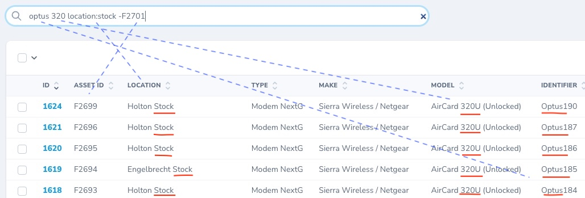

# smart-search-php

Simple (yet powerful) PHP search/filter providing unified results in multiple contexts:

* MySQL/other databases (ie: "where" clause builder)
* PHP arrays
* Laravel Collections
* Laravel Models
* Laravel Nova Resources

Simple Google-style search strings perform complex filter operations across multiple fields.

(PHP backend equivalent of [`miking/smart-search-filter`](https://github.com/miking7/smart-search-filter) javascript library JS library)

## Screenshot:



## Installation:

Require this package in the `composer.json` of your project.

```bash
composer require faithfm/smart-search-php
```

> Note: an [additional dependency](docs/wherenot-dependency.md) must be manually installed for **Laravel** Models & Nova Resources.  (Applies to Laravel <= 8.x)

## Usage Examples:

Start by creating an instance of `SmartSearch` with the **search string**, and a list of **default search fields**:

```php
use FaithFM\SmartSearch\SmartSearch;

$search = 'optus 320 location:stock -F2701';
$smartSearch = new SmartSearch($search, 'asset_id|location|type|make|model|identifier');
```
The parsed search-string can now be used to perform filtering in one or more contexts:

* Context 1 - [PHP Array](docs/c1-arrays.md) filtering:

```php 
$filtered = $smartSearch->filterArray($items));
```

* Context 2 - [Laravel Collection](docs/c2-laravel-collections.md) filtering:

```php
$filteredCollection = $smartSearch->filterCollection($myCollection));
```

* Context 3 - [SQL Database where-clause](docs/c3-sql-database.md) filtering:

```php
$whereClause = $smartSearch->getSqlFilter());
```

* Context 4 - [Laravel Database Query Builder](docs/c4-laravel-db-builder.md) (DB or Model) filtering:
```php
$data = DB::table('my_table')::where($smartSearch->getBuilderFilter())->get();
// OR
$data = MyModel::where( $smartSearch->getBuilderFilter() )->get();
```

* Context 5 - [Laravel Eloquent Model](docs/c5-laravel-eloquent-models.md) filtering:

```php
MyModel::smartSearch('joe', 'location|type')->get();
```

* Context 6 - [Laravel Nova Resource](docs/c6-laravel-nova-resources.md) filtering:  *(ie: as shown in the screenshot above)*

```php
class MyResource extends Resource
{
    use SmartSearchableNovaResource;
    ...
```

## Search Syntax:

The related [`miking/smart-search-filter`](https://github.com/miking7/smart-search-filter) javascript library includes [documentation](https://github.com/miking7/smart-search-filter#example) of how a simple Google-style search syntax is used to perform complex filter operations across multiple fields.

Note: Used together these two libraries provide a simple, unified, yet powerful approach to front-end/back-end filtering in modern web applications.

## Debug Information:

Under the hood, a "filter operations" array is created when a search string is parsed.  
The `getFilterOpsDescription()` function provides a human-readable representation showing the parsed intent of the search string, and parsing errors are also available:

```php
var_dump($smartSearch->errors);
var_dump($smartSearch->getFilterOpsDescription());
```

## Advanced Options:

The above examples have demonstrated the simple case where only two arguments are provided to the `SmartSearch` constructor, however a number of other advanced options are also available.

```php
new SmartSearch($searchString, $defaultFields = "", $allowedFields = "", $options = [], Closure $sqlEscapeStringFn = null)
```

Notes:

* `$allowedFields` are the same as `$defaultFields` if not specified explicitly.

* Fields lists can be specified in a many different ways:

```php
$defaultFields = 'location,type';       // comma-separated
$defaultFields = 'location, type';      // comma-separated (with spaces)
$defaultFields = 'location|type';       // pipe-separated
$defaultFields = ['location', 'type'];  // array format
//... and pretty much anything else that can be cast to an array (of strings)
```

* The `$options` parameter accepts an associative array or StdClass object and allows things like case sensitivity and sql wildcard characters to be defined.  Default options are:

```php
const DEFAULT_OPTIONS = [
    'caseSensitive' => false,
    'sqlWildcard' => '%',
    'sqlWildcardSingleChar' => '_',
];
```

> Note: all filters are currently case-insensitive.  The `caseSensitive` option does not currently work.

* The `$sqlEscapeStringFn` can be specified in the constructor instead of calling `setSqlEscapeStringFn()` later.
